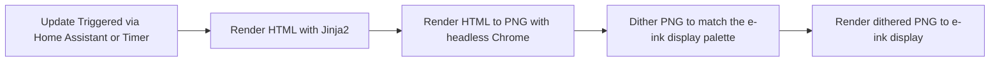

# eink-dash

A home dashboard for e-ink displays, rendered using HTML and CSS with Jinja2 templates.

<!-- TODO: Add a screenshot -->

## Configuration

See [config.json](./config.json) for an example configuration file. The
dashboard itself is configured using HTML/CSS and Jinja2 templates, which can be
found in the [dashboard](./dashboard) directory.

## Deployment

The project is deployed using Docker. To build and run the docker container, use the following commands:

```bash
docker build -t eink-dash .
docker run -d --name eink-dash -v /path/to/config.json:/app/config.json eink-dash
```

## Development

Each step of the [pipeline](#pipeline) can be run independently for development
and testing purposes. See the README files in the respective directories.

## Pipeline

The following pipeline is run to produce the final image on the e-ink display:


