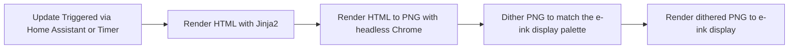

# eink-dash

A home dashboard for e-ink displays, rendered using HTML and CSS with Jinja2 templates.
Currently supports Waveshare 4-color e-ink displays.

<!-- TODO: Add a screenshot -->

## Configuration

See [config.jsonc](./config.jsonc) for an example configuration file. The
dashboard itself is configured using HTML/CSS and Jinja2 templates, which can be
found in the [dashboard](./dashboard) directory.

## Deployment

The project is deployed using Docker. To build and run the docker container, use the following commands:

```bash
docker build -t eink-dash .
docker run -d --name eink-dash -v /path/to/config.jsonc:/app/config.jsonc eink-dash
```

## Development

Each step of the [pipeline](#pipeline) can be run independently for development
and testing purposes. See the README files in the respective directories.

The main entrypoint for the dashboard is `eink-dash.py`, which can be run directly for development:

```bash
uv run eink-dash.py
```

## Pipeline

The following pipeline is run to produce the final image on the e-ink display:



## Attributions

This project uses the [waveshare-epd library](https://github.com/waveshareteam/e-Paper) for interfacing with the e-ink display, which is released under the MIT License.

### Icons

* <a href="https://www.flaticon.com/free-icons/sun" title="sun icons">Sun icons created by DinosoftLabs - Flaticon</a>
* <a href="https://www.flaticon.com/free-icons/sunset" title="sunset icons">Sunset icons created by Icon Hubs - Flaticon</a>
* <a href="https://www.flaticon.com/packs/weather-560">Weather icons created by berkahicon - Flaticon</a>
* <a href="https://www.magnific.com/author/photoono/icons/generic-flat_1807">Icons by ono_tono</a>
<a href="https://www.flaticon.com/free-icons/weather" title="weather icons">Weather icons created by iconixar - Flaticon</a>