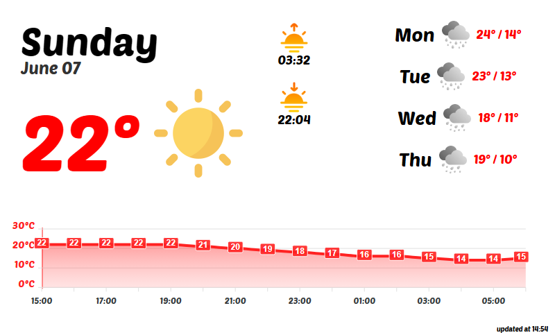
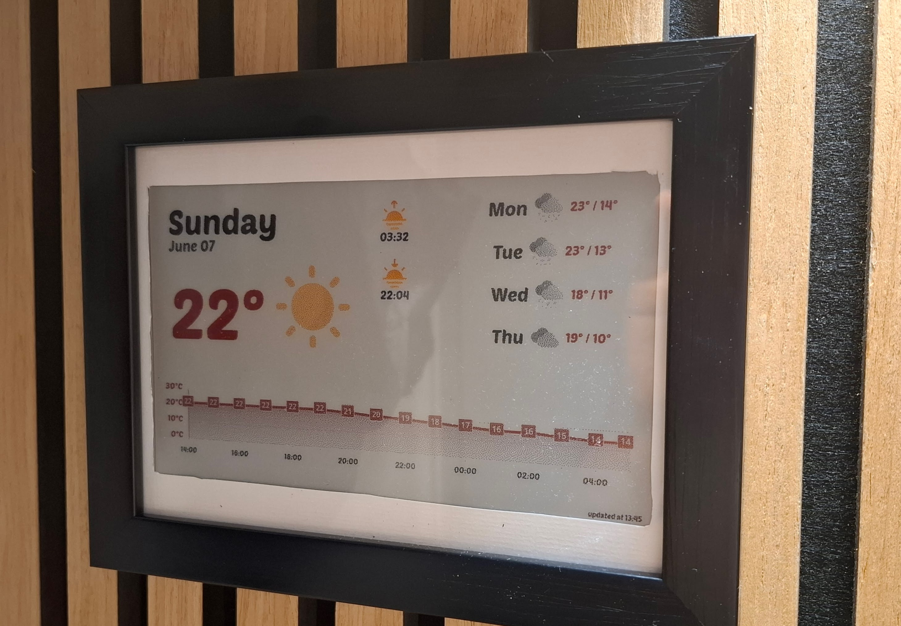

<div align="center">

# eink-dash

**A weather dashboard for e-ink displays, rendered using HTML/CSS with Jinja2 templates.**

*Currently supports Waveshare 4-color e-ink displays.*

<table><tr>
<td></td>
<td></td>
</tr></table>

</div>

## Overview


## Prerequisites

The application runs in Docker, but can also be run directly with:

| Prerequisite | Purpose |
|---|---|
| **[uv](https://docs.astral.sh/uv/)** | Python dependency management |
| **Chromium or Chrome** | Headless HTML-to-PNG rendering |
| **Rust / Cargo** | Compiling the [dithers](./dithers/README.md) image processing module |

## Configuration

See [config.jsonc](./config.jsonc) for a documented example configuration file. The
dashboard itself is configured using HTML/CSS and Jinja2 templates, which can be
found in the [`dashboard/`](./dashboard) directory.

## Pipeline

Each refresh runs the following steps:


## Deployment

The application supports two deployment modes:

| Mode | Description |
|---|---|
| **Local** | Everything runs on the device connected to the display (e.g. a Raspberry Pi) |
| **Remote** | Rendering runs on a separate machine or in Docker; a small driver server runs on the display device |

The remote mode is useful for development, as it allows you to run most of the
pipeline locally on your desktop, while using a low-power device like a
Raspberry Pi Zero to interface with the display.

<details>
<summary><b>Local Mode</b></summary>

<br>

1. Build the dithers module:

   ```bash
   cargo build --release --manifest-path dithers/Cargo.toml
   ```

2. Set `output.mode` to `"local"` in [config.jsonc](./config.jsonc).

3. Run:

   ```bash
   uv run eink-dash.py
   ```

</details>

<details>
<summary><b>Remote Mode</b></summary>

<br>

**On the device connected to the display**, start the driver server:

```bash
uv run driver/server.py
```

**On the rendering machine**, set `output.mode` to `"remote"` and configure `output.host` and `output.port` in [config.jsonc](./config.jsonc).

Then run using Docker (recommended):

```bash
docker build -t eink-dash .
docker run -d --name eink-dash eink-dash
```

> **Note:** `config.jsonc` is copied into the image at build time. Edit it before running `docker build`, or mount a custom config at runtime with `-v /path/to/config.jsonc:/app/config.jsonc`.

Or without Docker (requires the prerequisites above):

```bash
uv run eink-dash.py
```

</details>

---

## Development

Each step of the pipeline can be run in isolation. See the README in each component's directory:

| Component | Description |
|---|---|
| [`trigger/`](./trigger/README.md) | Update triggering |
| [`dashboard/`](./dashboard/README.md) | HTML rendering |
| [`dithers/`](./dithers/README.md) | Image dithering |
| [`driver/`](./driver/README.md) | E-ink display driver and server |

To work on the full pipeline end-to-end, run the driver server on the display device and run the rendering locally as described in [Remote Mode](#remote-mode).

## Attributions

This project uses the [waveshare-epd library](https://github.com/waveshareteam/e-Paper) (MIT License) for interfacing with the e-ink display.

<details>
<summary><b>Icon Credits</b></summary>

<br>

- [Sun icons](https://www.flaticon.com/free-icons/sun) by DinosoftLabs — Flaticon
- [Sunset icons](https://www.flaticon.com/free-icons/sunset) by Icon Hubs — Flaticon
- [Weather icons](https://www.flaticon.com/packs/weather-560) by berkahicon — Flaticon
- [Icons](https://www.magnific.com/author/photoono/icons/generic-flat_1807) by ono_tono
- [Weather icons](https://www.flaticon.com/free-icons/weather) by iconixar — Flaticon

</details>